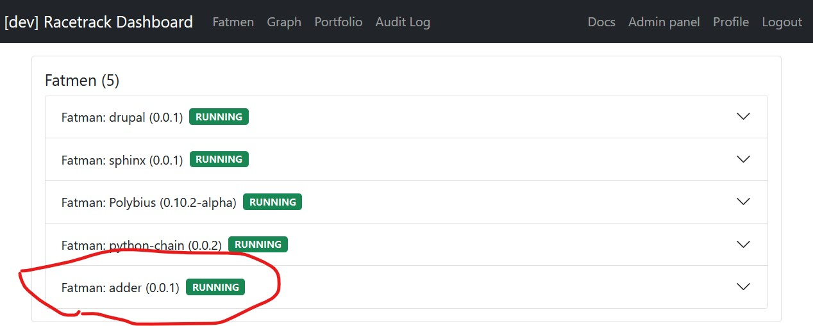
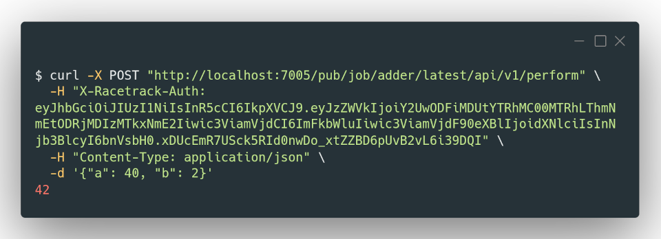

# Racetrack

[](https://github.com/TheRacetrack/racetrack)
[](https://pypi.org/project/racetrack-client/)
[](https://theracetrack.github.io/racetrack)
[](https://github.com/TheRacetrack/racetrack/actions?query=workflow%3Atest)

Racetrack is an opinionated framework for deploying, managing, and serving
application workloads.

## Features

Racetrack uses the notion of conventions to allow domain experts to produce
operationally sound and effective workloads without understanding the underlying
infrastructure.

It makes extensive use of plugins. Thus, the type of code which it can accept is
broad and covers languages such as Python 3 or golang, frameworks such as
django, and actual applications such as Sphinx or Drupal.

These "job types", in Racetrack lingo, can be deployed to different
"infrastructure targets". We currently support Kubernetes and Docker. This is
also pluggable and can be extended.

Code deployed via Racetrack gets free Swagger pages and Prometheus metrics endpoints.

## Example usage

Given a Python file like this:

```python
class Meow:
    def perform(self, a, b):
        """Add numbers"""
        return a + b
```

And a YAML file like this:

```yaml
name: adder
owner_email: meowmeow@example.com
lang: python3:latest

git:
  remote: https://www.github.com/path/to-repo.git

python:
  entrypoint_path: 'adder.py'
  entrypoint_class: 'Meow'
```

You can

```bash
racetrack deploy
```

And the result is a micro-service with an API:


which can be monitored on a dashboard:



or called with a curl command:



## Getting started

For new users, you can run Racetrack locally in a [KinD](https://kind.sigs.k8s.io/) environment;
please follow the [Tutorial](docs/user.md#tutorial).

* [Using Racetrack](docs/user.md)
* [Deploying Racetrack](docs/development/develop.md)
* [Administering Racetrack](docs/admin.md)
* [Using plugins](docs/development/using-plugins.md)
* [Developing plugins](docs/development/developing-plugins.md)
* [Developing a new job type](docs/development/plugins-job-types.md)

See the [Documentation](https://theracetrack.github.io/racetrack/) for more details.

## Currently supported

### What can we deploy?

* [Python 3](https://github.com/TheRacetrack/plugin-python-job-type)
* [Go](https://github.com/TheRacetrack/plugin-go-job-type)
* [Rust](https://github.com/TheRacetrack/plugin-rust-job-type)
* [Any language wrapped in a Dockerfile](https://github.com/TheRacetrack/plugin-docker-proxy-job-type)
* [HUGO framework](https://github.com/TheRacetrack/plugin-hugo-job-type)
* [Drupal](https://github.com/TheRacetrack/plugin-docker-proxy-job-type/tree/master/sample/drupal)
* [Sphinx](https://github.com/TheRacetrack/plugin-docker-proxy-job-type/tree/master/sample/sphinx)

### Where can we deploy to?

* [Kubernetes](https://github.com/TheRacetrack/plugin-kubernetes-infrastructure)
* [local Docker](https://github.com/TheRacetrack/plugin-docker-infrastructure)
* [remote Docker Daemon](https://github.com/TheRacetrack/plugin-docker-daemon-deployer)

## About

Racetrack is copyright The Danish Business Authority 2022.
It is published under the [Apache 2.0 License](./LICENSE).
See [Copyright Notices](./docs/license/copyright-notices.md).

This project is a collaboration between [The Danish Business Authority](https://www.erhvervsstyrelsen.dk) and [deepsense.ai](https://deepsense.ai).
