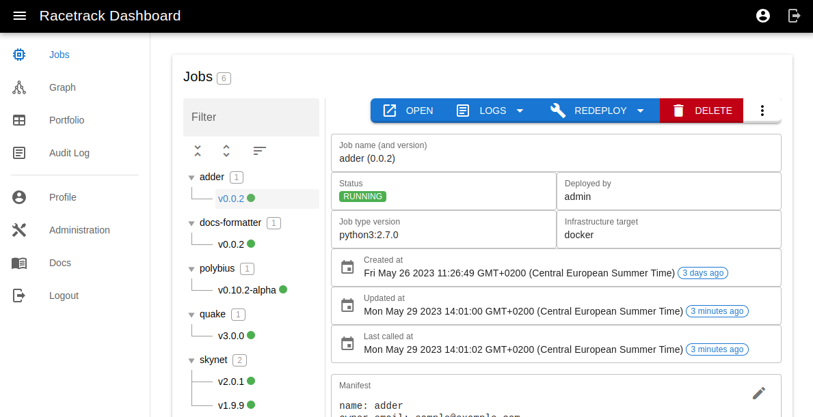

# Racetrack

[](https://github.com/TheRacetrack/racetrack)
[](https://pypi.org/project/racetrack-client/)
[](https://theracetrack.github.io/racetrack)
[](https://github.com/TheRacetrack/racetrack/actions?query=workflow%3Atest)

Racetrack is a framework for deploying, managing, and serving application workloads.

<video width="100%" controls="true" allowFullscreen="true" src="https://user-images.githubusercontent.com/124889668/259023408-d7b99acf-fcef-48f3-ac95-d4356c3acb0f.mp4">
</video>

## Features

Racetrack uses the notion of conventions to allow domain experts to produce
operationally sound and effective workloads without understanding the underlying
infrastructure.

It makes extensive use of plugins. Thus, the type of code which it can accept is
broad and covers languages such as Python 3 or Go, 
and actual applications such as Sphinx, Drupal or even Quake 3.

These "jobs", in Racetrack lingo, can be deployed to different
"infrastructure targets". We currently support Kubernetes and Docker. This is
also pluggable and can be extended.

Code deployed via Racetrack gets free Swagger pages and Prometheus metrics endpoints.

What distinguishes Racetrack is:

- **Server-side building**. Code is transformed into a microservice without your computer being involved.
- You only supply your **function's logic**. No need to write repetitive API code, setting up 
  webservers, creating dockerfiles, kubernetes YAMLs, and so on. Racetrack takes care of that for you.
- **Language agnostic**. Deploy code written in Python 3, Go, Rust,
  or anything else encapsulated in a Dockerfile.
- **Infrastructure independent**. Deploy to either a Kubernetes cluster
  or a Docker environment in a single transparent step.
- **Multiple job versions, immutable by design**. Immutable things tend to be more reliable.
- **Customizable through plugins**,
- **Reproducible jobs**. Racetrack ensures that anyone else can deploy the same job effortlessly.
- **Out-of-the-box tools**: web endpoints, API documentation,
  metrics, monitoring, tracing, and more.
- **Production readiness**: authentication tokens, permissions management, scalability
- Released under a **permissive open-source license**,
- Suitable for both **on-premises and cloud** environments.

## Example usage

Given a Python file like this:

```python
class Meow:
    def perform(self, a, b):
        """Add numbers"""
        return a + b
```

And a YAML file like this:

```yaml
name: adder
owner_email: meowmeow@example.com
lang: python3:latest

git:
  remote: https://www.github.com/path/to-repo.git

python:
  entrypoint_path: 'adder.py'
  entrypoint_class: 'Meow'
```

You can

```bash
racetrack deploy
```

And the result is a micro-service with an API:


which can be monitored on a dashboard:



or called with a curl command:


[//]: # (created with https://carbon.now.sh/?bg=rgba%28255%2C255%2C255%2C1%29&t=material&wt=boxy&l=application%2Fx-sh&width=812&ds=true&dsyoff=20px&dsblur=68px&wc=true&wa=false&pv=56px&ph=56px&ln=false&fl=1&fm=Hack&fs=14px&lh=133%25&si=false&es=2x&wm=false&code=%2524%2520curl%2520-X%2520POST%2520%2522http%253A%252F%252Flocalhost%253A7005%252Fpub%252Fjob%252Fadder%252Flatest%252Fapi%252Fv1%252Fperform%2522%2520%255C%250A%2520%2520-H%2520%2522X-Racetrack-Auth%253A%2520eyJhbGciOiJIUzI1NiIsInR5cCI6IkpXVCJ9.eyJzZWVkIjoiY2UwODFiMDUtYTRhMC00MTRhLThmNmEtODRjMDIzMTkxNmE2Iiwic3ViamVjdCI6ImFkbWluIiwic3ViamVjdF90eXBlIjoidXNlciIsInNjb3BlcyI6bnVsbH0.xDUcEmR7USck5RId0nwDo_xtZZBD6pUvB2vL6i39DQI%2522%2520%255C%250A%2520%2520-H%2520%2522Content-Type%253A%2520application%252Fjson%2522%2520%255C%250A%2520%2520-d%2520%27%257B%2522a%2522%253A%252040%252C%2520%2522b%2522%253A%25202%257D%27%250A42)

## Getting started

For new users, you can run Racetrack locally in a [KinD](https://kind.sigs.k8s.io/) environment;
please follow the [Tutorial](docs/user.md#tutorial).

* [User Guide](docs/user.md)
* [Quickstart - local installation](docs/quickstart.md)
* [Glossary](docs/glossary.md)
* [Installation to Kubernetes](docs/deployment/k8s-installation.md)
* [Using plugins](docs/development/using-plugins.md)
* [Developing plugins](docs/development/developing-plugins.md)
* [Developing a new job type](docs/development/plugins-job-types.md)
* [CLI client](racetrack_client/README.md)
* [Developing Racetrack](docs/development/develop.md)
* [Administering Racetrack](docs/admin.md)

See the [Documentation](https://theracetrack.github.io/racetrack/) for more details.

## Currently supported

### What can we deploy?

* [Python 3](https://github.com/TheRacetrack/plugin-python-job-type)
* [Go](https://github.com/TheRacetrack/plugin-go-job-type)
* [Rust](https://github.com/TheRacetrack/plugin-rust-job-type)
* [Any language wrapped in a Dockerfile](https://github.com/TheRacetrack/plugin-docker-proxy-job-type)
* [HUGO framework](https://github.com/TheRacetrack/plugin-hugo-job-type)
* [Drupal](https://github.com/TheRacetrack/plugin-docker-proxy-job-type/tree/master/sample/drupal)
* [Sphinx](https://github.com/TheRacetrack/plugin-docker-proxy-job-type/tree/master/sample/sphinx)
* [Quake III](https://github.com/iszulcdeepsense/racetrack-quake)

### Where can we deploy to?

* [Kubernetes](https://github.com/TheRacetrack/plugin-kubernetes-infrastructure)
* [local Docker](https://github.com/TheRacetrack/plugin-docker-infrastructure)
* [remote Docker Daemon](https://github.com/TheRacetrack/plugin-docker-daemon-deployer)

## About

This software is copyright Erhvervsstyrelsen.
It is published under the [Apache 2.0 License](./LICENSE).
See [Copyright Notices](./docs/license/copyright-notices.md).

This project is a collaboration between [The Danish Business Authority](https://www.erhvervsstyrelsen.dk) and [deepsense.ai](https://deepsense.ai).
