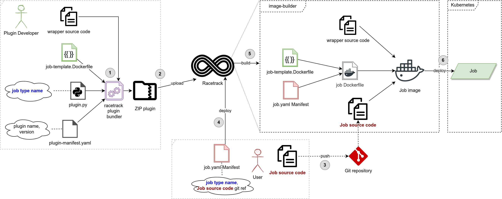

# Job type plugins

This tutorial shows  how to create a plugin extending Racetrack with your own job types.
Job types allow you to run applications written in specific programming languages.

## Overall flow

Here's the overall flow which describes how job types are created
and used by others to deploy fatmen workloads:

[](../assets/job-type-plugins.png)

1. **Plugin Developer** writes the source code of a wrapper and base.Dockerfile.
  He creates plugin code, fatman template Dockerfile and plugin Manifest.
  Next, he turns it into a ZIP plugin using a plugin bundler.
2. He uploads the plugin to the Racetrack.
3. **Data Scientist** writes the source code of his Job and pushes it to a Git repository.
4. He creates fatman.yaml Manifest (including job type name and reference to a git repository)
  and starts a deployment using racetrack client.
5. Racetrack builds the base image and the Fatman image made of templated fatman Dockerfile
  and the Job source code pulled from git.
6. Racetrack creates Kubernetes resources for the Fatman workload.

## How to create a job-type plugin

As an example, let's make a plugin to run jobs written in [Rust programming language](https://www.rust-lang.org/).

### 1. Create a git repository
Create a git repository (or use existing one) to keep the source code of the plugin.

We're going to use https://github.com/TheRacetrack/plugin-rust-job-type 
repository and we'll place the plugin inside `rust-job-type` subdirectory.

### 2. Initialize plugin manifest
Create `plugin-manifest.yaml` file in a `rust-job-type` subdirectory.
It contains the metadata of the plugin, including name, version
and the URL of the plugin home page.

```yaml
name: rust-job-type
version: 1.0.0
url: https://github.com/TheRacetrack/plugin-rust-job-type
```

### 3. Write the wrapper
Let's create the "wrapper" written in the language of choice.
Wrapper is a program that runs given source code, wraps it up in a Web server,
adds some features to it (eg. metrics, swagger page) 
and forwards the HTTP requests, calling the wrapped code.
In other words, "Language Wrapper" converts your code written in your language
to a standardized Fatman web service.

This section would be different for each language.
When it comes to Rust, we can organize the wrapper code in the following structure:
```
rust_wrapper
├── Cargo.toml
└── src
    ├── handler
    │   └── mod.rs
    ├── health.rs
    ├── main.rs
    └── server.rs
```

Let's assume that the user's source code will be placed in `rust_wrapper/src/handler/` subfolder.
It will be injected there by docker during building the image.

We'll do that way because Rust is a compiled language. 
If it was interpreted language (like Python), 
we could possibly load Python modules on the fly from the given source code location
(see [Python wrapper](../../wrappers/python_wrapper/fatman_wrapper)).

Here's how `rust_wrapper/src/handler/mod.rs` looks like:

```rust
// This is just a stub for IDE.
// It gets replaced by user's Fatman code in fatman-template.Dockerfile
use std::collections::HashMap;
use serde_json::{Value, json};

pub fn perform(input: HashMap<String, Value>) -> Value {
    json!(input)
}
```

Although it contains just a mock implementation,
it will be used the same way with real source code.
The stub above will be replaced by user's code.
`perform(input: HashMap<String, Value>)` function is our interface between wrapper and user's code.
User is only required to provide the function matching this interface.

`rust_wrapper/src/main.rs` contains the main function setting up the server:
<details>
  <summary>File `rust_wrapper/src/main.rs`</summary>

```rust
mod server;
mod handler;
mod health;

fn main() {
    server::serve().unwrap();
}
```
</details>

`rust_wrapper/src/server.rs` contains the function that starts the server and redirects calls to perform function:
<details>
  <summary>File `rust_wrapper/src/server.rs`</summary>

```rust
use actix_web::{web, App, HttpResponse, HttpServer, Responder};
use actix_web::middleware::Logger;
use log::{info, LevelFilter};
use env_logger::{Builder, Target};
use std::collections::HashMap;
use serde_json::{Value};
use crate::handler::perform;
use crate::health::{health_handler, live_handler, ready_handler};
use std::env;

#[actix_web::main]
pub async fn serve() -> std::io::Result<()> {
    Builder::new()
        .target(Target::Stdout)
        .filter(None, LevelFilter::Debug)
        .init();
    info!("I wish only to serve...");

    let fatman_name = env::var("FATMAN_NAME").unwrap();
	// Serve endpoints at raw path (to facilitate debugging) and prefixed path (when accessed through PUB).
	// Accept any version so that fatman can be called by its many version names ("latest", "1.x").
	let base_urls: Vec<String> = vec![
		format!("/pub/fatman/{name}/{{version}}", name=fatman_name),
		String::new(),
    ];

    HttpServer::new(move || {
        let mut app = App::new();

        for base_url in base_urls.iter() {
            app = app
                .route(&*format!("{}", base_url), web::get().to(homepage))
                .route(&*format!("{}/", base_url), web::get().to(homepage))
                .route(&*format!("{}/health", base_url), web::get().to(health_handler))
                .route(&*format!("{}/live", base_url), web::get().to(live_handler))
                .route(&*format!("{}/ready", base_url), web::get().to(ready_handler))
                .route(&*format!("{}/api/v1/perform", base_url), web::post().to(perform_handler))
        }

        app.wrap(Logger::default())
    })
    .bind(("0.0.0.0", 7000))?
    .run()
    .await
}

async fn homepage() -> impl Responder {
    HttpResponse::Ok().body("This is a fatman built with Rust language wrapper")
}

async fn perform_handler(input: web::Json<HashMap<String, Value>>) -> web::Json<Value> {
    let input_map: HashMap<String, Value> = input.into_inner();
    let output: Value = perform(input_map);
    web::Json(output)
}
```
</details>


`rust_wrapper/src/health.rs` handles liveness and readiness probes:
<details>
  <summary>File `rust_wrapper/src/health.rs`</summary>

```rust
use actix_web::{web};
use serde::{Serialize};
use std::env;

#[derive(Serialize)]
pub struct HealthResponse {
    service: String,
    fatman_name: String,
    fatman_version: String,
    git_version: String,
    deployed_by_racetrack_version: String,
    status: String,
    deployment_timestamp: u64,
}

#[derive(Serialize)]
pub struct LiveResponse {
    status: String,
    deployment_timestamp: u64,
}

#[derive(Serialize)]
pub struct ReadyResponse {
    status: String,
}

pub async fn health_handler() -> web::Json<HealthResponse> {
    let deployment_timestamp: u64 = env::var("FATMAN_DEPLOYMENT_TIMESTAMP").unwrap().parse().unwrap();
    let fatman_name = env::var("FATMAN_NAME").unwrap();
    let fatman_version = env::var("FATMAN_VERSION").unwrap();
    let git_version = env::var("GIT_VERSION").unwrap();
    let racetrack_version = env::var("DEPLOYED_BY_RACETRACK_VERSION").unwrap();
    web::Json(HealthResponse {
        service: String::from("fatman"),
        fatman_name: fatman_name,
        fatman_version: fatman_version,
        git_version: git_version,
        deployed_by_racetrack_version: racetrack_version,
        status: String::from("pass"),
        deployment_timestamp: deployment_timestamp,
    })
}

pub async fn live_handler() -> web::Json<LiveResponse> {
    let deployment_timestamp: u64 = env::var("FATMAN_DEPLOYMENT_TIMESTAMP").unwrap().parse().unwrap();
    web::Json(LiveResponse {
        status: String::from("live"),
        deployment_timestamp: deployment_timestamp,
    })
}

pub async fn ready_handler() -> web::Json<ReadyResponse> {
    web::Json(ReadyResponse {
        status: String::from("ready"),
    })
}
```
</details>

`rust_wrapper/Cargo.toml` is the file with package dependencies used by Rust:
<details>
  <summary>File `rust_wrapper/Cargo.toml`</summary>

```ini
[package]
name = "rust_wrapper"
version = "0.1.0"
edition = "2021"

[dependencies]
actix-web = "4.0.1"
serde = { version = "1.0.137", features = ["derive"] }
log = "0.4.17"
env_logger = "0.9.0"
serde_json = "1.0.81"
```
</details>

We can test the server locally by running:
```bash
cd rust_wrapper &&\
FATMAN_NAME=rust-function FATMAN_VERSION=0.0.1 FATMAN_DEPLOYMENT_TIMESTAMP=0 cargo run
```

We can test its response with:
```bash
curl -X POST \
		"http://localhost:7000/pub/fatman/rust-function/latest/api/v1/perform" \
		-H "Content-Type: application/json" \
		-d '{"numbers": [40, 2]}'
```

#### Wrapper Principles

Every wrapper has to follow some rules:

- HTTP server MUST run on port 7000, address `0.0.0.0`.
- HTTP server MUST mount endpoints at `/pub/fatman/{name}/{version}` base URL,
  where `{name}` is the name of the fatman taken from `FATMAN_NAME` environment 
  variable (it will be assigned by docker) and `{version}` should match any string 
  (due to fatman can be accessed by explicit version or by `latest` alias).
- HTTP server MUST have `/live` and `/ready` endpoints returning `200` status code, 
  once it's alive and ready to accept requests.
- `/live` endpoint MUST return `{"deployment_timestamp": 1654779364}` JSON object.
  `"deployment_timestamp"` integer value should be taken from 
  `FATMAN_DEPLOYMENT_TIMESTAMP` environment variable (it will be set by docker).
  This is the timestamp of the deployment, it's needed to distinguish versions 
  in case of asynchronous redeployment of the fatman.
  `/live` endpoint MAY contain other JSON fields as well.
- You MAY implement swagger documentation for your endpoints on root endpoint.
- You MAY implement `/metrics` endpoint for exposing Prometheus metrics.
- You MAY expose any other endpoints.
- Be careful to isolate libraries / requirements installed by the user
  from the versions of the libraries used by the core wrapper.

### 4. Prepare base Dockerfile

Building of the fatman docker image is split into two steps, having performance of the building in mind:

1. **Building base image** - 
  Base image contains files common to every fatman (wrapper code).
  Base image doesn't depend on any particular fatman or manifest.
  The image is built by Racetrack once on first use.
2. **Building fatman from template** - 
  Fatman Dockerfile is the outcome of the Dockerfile template and the manifest of the fatman that is about to be deployed.
  The fatman image extends the base image.
  The job source code is injected into the image during building.
  This step is done for every fatman and the building is done by Racetrack on the cluster servers.
  If there's some logic that depends on the particular fatman manifest, it should be included here.
  For instance, `FATMAN_NAME` env variable is configured here because it depends on the fatman manifest.

Having that in mind, let's create a `base.Dockerfile`:

```dockerfile
FROM rust:1.60-slim-buster

WORKDIR /src/rust_wrapper

# Install just the dependencies first, this is a trick to optimize building time by creating cached layer
RUN cargo init
COPY rust_wrapper/Cargo.toml rust_wrapper/Cargo.lock /src/rust_wrapper/
RUN cargo build

# Copy wrapper code to the image
COPY rust_wrapper/src /src/rust_wrapper/src/
RUN cargo check && cargo clean
# Remove the stub that is about to be replaced
RUN rm -rf /src/rust_wrapper/src/handler

# Label image so the container can be identified as fatman (for automated cleanup)
LABEL racetrack-component="fatman"
```

We can test it if it builds without errors:
```bash
DOCKER_BUILDKIT=1 docker build \
    -t racetrack/fatman-base/rust:1.0.0 \
    -f base.Dockerfile .
```

### 5. Prepare fatman template Dockerfile
Next, we need to create a template for Dockerfile that will be generated for each fatman.

It should be a Jinja2 template, it can make use of the following variables:

- `base_image` - the name of the base docker image to use for building a fatman
- `env_vars` - dict with environment variables that should be assigned to the fatman container
- `manifest` - whole Fatman Manifest object (see [Fatman Manifest Schema](../manifest-schema.md))
- `git_version` - version of the fatman code taken from git repository
- `deployed_by_racetrack_version` - version of the Racetrack that has been used to build this image 
  (you can use it in the application to present it somewhere)

Here's `fatman-template.Dockerfile`:

```Dockerfile
# It extends wrapper image
FROM {{ base_image }}

# Setting environment variables from env_vars

ENV {{ env_key }} "{{ env_value }}"


# Install additional libraries requested by user in its manifest
# Note: package manager (apt) should be compliant with the base image we used earlier (rust:1.60-slim-buster)

RUN apt-get update -y && apt-get install -y \
    {{ manifest.system_dependencies | join(' ') }}


# Finally, copy the fatman source code in the place where the wrapper expects it
COPY . /src/rust_wrapper/src/handler/
# Make sure directory is writable and build the executable
RUN chmod -R a+rw /src/rust_wrapper && cd /src/rust_wrapper/ && cargo build

# Set the main command to run the fatman executable
CMD /src/rust_wrapper/target/debug/rust_wrapper < /dev/null

# Set environment variables that are expected by fatman executable
ENV FATMAN_NAME "{{ manifest.name }}"
ENV FATMAN_VERSION "{{ manifest.version }}"
ENV GIT_VERSION "{{ git_version }}"
ENV DEPLOYED_BY_RACETRACK_VERSION "{{ deployed_by_racetrack_version }}"
```

We won't build this Dockerfile now, it will be handled by Racetrack once the job is submitted.

### 6. Create `plugin.py` file

`plugin.py` is a file that is read by the Racetrack instance, when loading the plugin.
It should contain the `Plugin` class with the implemented methods,
depending on the functionality that it targets to provide.
See [developing-plugins.md](./developing-plugins.md) for the list of all supported hooks.

We want to provide job types with this plugin,
so let's implement `fatman_job_types` method.
It defines what's the name of our new job type (`'rust'`).
Also it has the reference to the base Dockerfile path
and the dockerfile template path we created earlier.

```python
from typing import Dict, Tuple
from pathlib import Path


class Plugin:
    def fatman_job_types(self) -> dict[str, list[tuple[Path, Path]]]:
        """
        Job types provided by this plugin
        :return dict of job type name (with version) -> list of images: (base image path, dockerfile template path)
        """
        return {
            f'rust:{self.plugin_manifest.version}': [(
                self.plugin_dir / 'base.Dockerfile',
                self.plugin_dir / 'fatman-template.Dockerfile',
            )],
        }
```

### 7. Create `.racetrackignore` file
We don't need to incorporate all the local files into a plugin ZIP file.
We can instruct `racetrack` plugin bundler to ignore these files by adding `.racetrackignore` file:
```
Cargo.lock
target
.gitignore

```

### 8. Bundle plugin into a ZIP file
Local source code of the plugin can be turned into a ZIP file
by means of a `racetrack` client tool.
Install it with: 
```shell
python3 -m pip install --upgrade racetrack-client
```

Let's run `racetrack plugin bundle` in a directory where the plugin is located (`rust-job-type` dir)
to turn a plugin into a ZIP file.
The outcome is `rust-job-type-1.0.0.zip`.

## Installing plugin to Racetrack

Now, we can make use of the plugin by installing it to Racetrack.

Let's go to the Dashboard Administration page
(you need to be staff user to see this tab)
and upload the zipped plugin there.

## Deploying sample fatman

Let's create an exemplary fatman `sample-rust-function` that will be deployed to Racetrack.

`mod.rs` file contains the logic we want to deploy:
```rust
use std::collections::HashMap;
use serde_json::{Value, json};

pub fn perform(input: HashMap<String, Value>) -> Value {
    let numbers = input.get("numbers").unwrap();
    let numbers: &Vec<Value> = numbers.as_array().unwrap();

    // Sum given numbers
    let sum = numbers.iter().fold(0, |acc, x| acc + x.as_i64().unwrap());

    json!(sum)
}
```

and the fatman manifest `fatman.yaml` might look like this:
```yaml
name: rust-function
owner_email: sample@example.com
lang: rust

git:
  remote: https://github.com/TheRacetrack/plugin-rust-job-type
  directory: sample-rust-function
```

Don't forget to push the fatman code to a git repository.

Finally, we can deploy this fatman to Racetrack:
```bash
racetrack deploy
```
