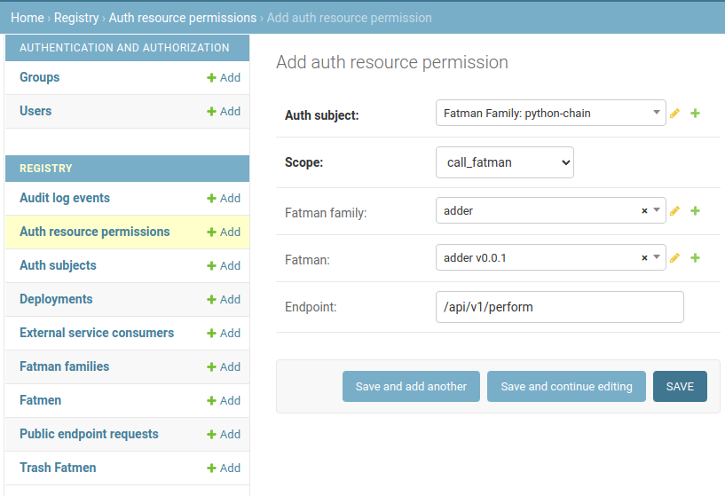

# Permission model
Racetrack v2 introduces a restrictive Fatman permissions model.

**Users**, **ESCs** and **Fatman Families** can be granted fine-grained permissions.
For instance, users can have access to a subset of fatmen and they
can see and manage only those that are allowed for them.

By default, nobody is allowed to do anything, if the permissions list is empty.
However, when a new user is created, a set of default permissions is created accordingly.
Admin can revoke these permissions later on.
New user comes with the permissions allowing him to:

- read all fatmen status (browse on a dashboard)
- call endpoints of every fatman
- deploy and redeploy fatmen
- delete only fatmen that has been deployed by him

Admin can grant or revoke permissions in an Admin Panel.

In general, single permission is an inclusive rule that can be stated as a sentence:
```
<SUBJECT> can <SCOPE> with the <RESOURCE>.
```

- `<SUBJECT>` - someone who is allowed to perform the action.
- `<SCOPE>` is the verb in this sentence. It denotes the action that can be performed.
- `<RESOURCE>` denotes the system resource or a group of resources that the action can be executed on.

## Subject
The **Auth Subject** can be one of these:

- User
- Fatman Family
- ESC (External Service Consumer)

**Auth Subject** has an unique auth token and the record in a database
is automatically created by Racetrack in "Auth Subjects" table,
so it doesn't have to be managed by the Admin.

## Scope
Permission is related to one of the operation type, called "scope":

- `read_fatman` - list fatman, check fatman details
- `deploy_fatman` - deploy fatman in a particular family, redeploy fatman
- `deploy_new_family` - deploy new fatman family
- `delete_fatman` - move to trash, dismantle from a cluster
- `call_fatman` - call fatman endpoints
- `call_admin_api` - not important for regular users. Intended for internal communication between Racetrack services
- `full_access` - not important for regular users. Covers all above. Intended for administrators.

## Resource
Permisssion can cover either all fatmen, whole fatman family, single fatman or a signle endpoint.

When adding **Auth Resource Permission** (in Admin panel), there are filter fields,
which narrow down the permission only to the particular resources matching criteria.
If filter is not set, it covers all resources.

The resource can be filtered by the following fields:

- Fatman family
- Fatman
- Endpoint

All of these fields are optional. Each of them narrows down the filtering of the resources, which the permission covers.
For instance, if **Fatman** field is empty and the **Family** is set, the permission works for all fatmen within the family.
If none of the fields is filled, the permission works on all of the resources (all families, all fatmen, all endpoints).

Keep in mind that the permission may give an access not only to the existing resources, 
but also for those that are yet to come up in future.
For example, new fatman version from the same family will be affected, while there is a permission covering the whole family.

## How to grant a permission?
If you've run into an "Unauthorized" error like this:
```
Unauthorized: no permission to do this operation:
auth subject "Fatman Family: python-chain" does not have permission
to access endpoint /api/v1/perform at resource "adder v0.0.1"
with scope "call_fatman"
```

do the following to add the missing **Auth Resource Permission**:

1. Go to Lifecycle Admin panel (`/lifecycle/admin`). Click "Auth resource permissions", "Add".
1. Select Auth Subject (you can search it by name).
   For instance, type the name of the fatman family: `python-chain`.
1. Select the Scope, eg. `call_fatman`.
1. Narrow down "Fatman family", "Fatman" and "Endpoint" fields if needed.
1. Click Save.


