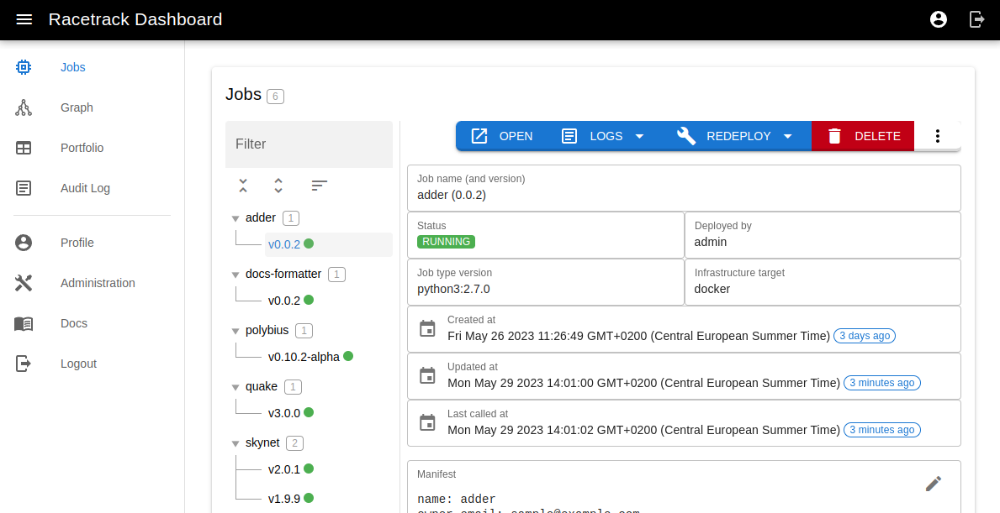

# User Guide - Deploying a Job

## The Racetrack Workflow

As a Racetrack user, to deploy a Job your workflow will typically look similar to this:

1. (Do it once) [Install Racetrack](#1-install-racetrack).
2. (Do it once) [Configure your racetrack client](#2-configure-your-racetrack-client).
3. [Write a piece of code doing something useful](#3-write-a-piece-of-code-doing-something-useful)
4. [Develop a Job](#4-develop-a-job) by picking the Job Type and following the Convention.
5. [Compose a Job Manifest](#5-compose-a-job-manifest)
6. [Push it to git](#6-push-it-to-git)
7. [Submit the Job code](#7-submit-the-job-code)
8. [Call the Job](#8-call-the-job)

These instructions will work against the local test version described in the
[Local Tutorial](../quickstart.md), but are also explained such that they make sense
against a production instance of Racetrack on a [real Kubernetes cluster](../deployment/k8s-installation.md).
You will follow the same workflow in both cases.

## 1. Install Racetrack

You have the following options:

- [Install Racetrack locally](../quickstart.md) - quickly setup Racetrack on local Docker engine.
- [Install Racetrack in local Kubernetes](../deployment/local-kubernetes-setup.md) - run Racetrack on Kind.
- [Install to standalone host](../deployment/standalone-host.md) - e.g. Virtual Machine or EC2
- Ask your friendly admin to install Racetrack for you and get you a link.

In this tutorial, we chose first option and we'll assume Racetrack is running on:

- [http://127.0.0.1:7102](http://127.0.0.1:7102) - Lifecycle API service
- [http://127.0.0.1:7103](http://127.0.0.1:7103) - Racetrack Dashboard

## 2. Configure your racetrack client

### Get the Racetrack CLI client

You need the [racetrack-client](https://pypi.org/project/racetrack-client/) CLI tool
installed to manage Jobs. Something like this ought to work:
```shell
python3 -m venv venv
. venv/bin/activate
python3 -m pip install --upgrade racetrack-client
racetrack --help
```

### Set Remote

You can set the current Racetrack server's URL (a "remote") with:
```shell
racetrack set remote http://127.0.0.1:7102
```

This then affects all subsequent invocations to `racetrack`,
if `--remote` parameter is not set explicitly.

#### Using a Production Racetrack

In the case of a production cluster, the only real change will be to the remote URL.
You will need to obtain the Racetrack address instead of
`127.0.0.1:7002`, so that:

```shell
racetrack set remote http://127.0.0.1:7102
```

becomes

```shell
racetrack set remote http://racetrack.platform.example.com:12345/lifecycle
```

Other endpoints described in the tutorial will also change away from
`localhost`. for example `http://127.0.0.1:7103/` might become
`https://racetrack-lifecycle.platform.example.com/dashboard`.
You will need to check with your local Racetrack admin to get these endpoints.
Or see [how-to deploy Racetrack on your own](../deployment/standalone-host.md).

### Create an account

Before you can deploy a job to production Racetrack server or even view the list
of Job on RT Dashboard, you need to create user there.

Visit your Racetrack Dashboard at `https://racetrack.platform.example.com/dashboard/`
(or local [http://127.0.0.1:7103/dashboard](http://127.0.0.1:7103/dashboard)), click link to **Register**.
Type username (an email) and password. Password will be needed to log in, 
so manage it carefully. Then notify your admin that he should activate your user.

### Activate the account

The administrator now has to visit Racetrack Dashboard, open **Administration** tab, open **Lifecycle Admin panel**, Browse the **Users**, and tick the **Active** checkbox near the new user.

### Authentication

When he does that, you can log in, and click **Profile** tab.
There will be your auth token for racetrack client CLI, along with ready command
to log in. It will look like `racetrack login <token> [--remote <remote>]`. When you
run this, then you can finally deploy your Job.

Alternatively, use command
```shell
racetrack login --username <username>
```
to log in with your username and password (entered into the standard input)
and to save the auth token without having to visit the Dashboard page.

If you need, you can log out with `racetrack logout [--remote <remote>]`. To check your
logged servers, there's `racetrack get config` command.

You can aceess Job pages though the browser as long as you're logged to Racetrack Dashboard.
Session is maintained through cookie.

When viewing Job swagger page, you can run there the `/perform` method without specifying
additional credentials, because auth data in cookie from Racetrack Dashboard is 
used as credential. However, if you copy the code to curl in CLI like this:
```shell
curl -X 'POST' \
  'https://racetrack.platform.example.com/pub/job/adder/0.0.1/api/v1/perform' \
  -H 'accept: application/json' \
  -H 'Content-Type: application/json' \
  -d '{
  "numbers": [
    40,
    2
  ]
}'
```
Then it won't work, because there's no auth data specified: 
`Unauthenticated: no header X-Racetrack-Auth: not logged in`

You will need to include it in curl using `-H 'X-Racetrack-Auth: $(racetrack get auth-token)`.

### Jobs in private git Repositories

As you noticed earlier, Racetrack requires in the `job.yaml` a git URL from
which to fetch the Job source code. If this repo is private or protected, you
will need to issue a token for the `racetrack` CLI tool to work. In GitLab, there
are two kinds of tokens (either of them can be used):

- Personal Access Token - allows to operate on all user projects. Instructions
  to create it are [here](https://docs.gitlab.com/ee/user/profile/personal_access_tokens.html) 
- Project Access Token - needs to be issued per project. User has to be Maintainer
  in project to be able to create such token. Instructions to create it are
  [here](https://docs.gitlab.com/ee/user/project/settings/project_access_tokens.html). 

In both cases it has to have `read_repository` privilege.

Once you have this token, you need to register it with the `racetrack` CLI tool:

```shell
racetrack set credentials REPO_URL USERNAME TOKEN
```
where:

- `REPO_URL`: url to git repository, i.e. `https://github.com/theracetrack/racetrack`
  You can also set this to root domain i.e. `https://github.com` to make this token
  handle all projects.
- `USERNAME`: it's your GitHub/Gitlab account name, usually in the form of email
- `TOKEN`: A token giving the **read-only** access to repository. Keep it secret.

### Setting aliases for Racetrack servers

You can set up aliases for Racetrack server URL addresses by issuing command:
```shell
racetrack set alias ALIAS RACETRACK_URL
```

If you operate with many environments, setting short names may come in handy. For instance:
```shell
racetrack set alias dev https://racetrack.dev.platform.example.com/lifecycle
racetrack set alias test https://racetrack.test.platform.example.com/lifecycle
racetrack set alias prod https://racetrack.prod.platform.example.com/lifecycle
racetrack set alias kind http://127.0.0.1:7002
racetrack set alias docker http://127.0.0.1:7102
```

and then you can use your short names instead of full `RACETRACK_URL` address when calling `racetrack deploy --remote dev`.

You can set the current remote with
```shell
racetrack set remote RACETRACK_URL_OR_ALIAS
```
and then you can omit `--remote` parameter in the next commands.

### Local Client Configuration

The `racetrack` CLI tool maintains a configuration on your developer workstation. 
As you saw earlier in the section on 
[Jobs in private git Repositories](#jobs-in-private-git-repositories)
it can store Project/Personal Access Tokens.

It is also possible to store the address of the Racetrack server:

```shell
racetrack set remote http://127.0.0.1:7002
```

Local client configuration is stored at `~/.racetrack/config.yaml`

## 3. Write a piece of code doing something useful

We've got a piece of Python code, checking if a given number is prime.
```python
import math

def is_prime(number: int) -> bool:
    """Check if a number is prime"""
    if number < 2:
        return False
    for i in range(2, int(math.sqrt(number)) + 1):
        if number % i == 0:
            return False
    return True
```

## 4. Develop a Job

You must pick the appropriate Racetrack [Job Type](./available-plugins.md)
and Refactor your code to follow its Convention.

### Job Type
These links show how to use particular job types installed by the [plugins](./available-plugins.md):

- [python3](https://github.com/TheRacetrack/plugin-python-job-type/blob/master/docs/job_python3.md) -
  designed for Python projects
- [golang](https://github.com/TheRacetrack/plugin-go-job-type/blob/master/docs/job_golang.md) -
  designed for Go projects
- [docker-proxy](https://github.com/TheRacetrack/plugin-docker-proxy-job-type/blob/master/docs/job_docker.md) -
  designed for any other Dockefile-based jobs

We decide to use `python3` job type.

See the [sample/](../../sample) directory for more examples.

### Refactor your code to follow the Convention

Python3 job type requires to embed our code in a `perform` method inside a class.
It also says that implementing method `docs_input_example` will show the example input values on the Swagger Documentation page.

Let's create `sample/python-primer/entrypoint.py` file:
```python
import math


class JobEntrypoint:
    def perform(self, number: int) -> bool:
        """Check if a number is prime"""
        if number < 2:
            return False
        for i in range(2, int(math.sqrt(number)) + 1):
            if number % i == 0:
                return False
        return True

    def docs_input_example(self) -> dict:
        """Return example input values for this model"""
        return {'number': 7907}
```

If needed, we might want to specify additional Python packages in **requirements.txt**,
but we skipped that as we don't need any third-party libraries this time.

### General Job Guidelines

This document uses the terms may, must, should, should not, and must not in
accord with [RFC 2119](https://datatracker.ietf.org/doc/html/rfc2119).

### Must

1. You must use one of the pre-defined (currently installed) job types.

### Should

1. The call path should be kept shallow. We prefer a bit bigger Job over
   small that creates a deep call path.
2. If part of the functionality of your Job becomes useful to a Service
   Consumer *other* than the current set of Service Consumers, consider if this
   part of its functionality should be split out into a separate Job. This is
   usually only a good idea of this part of the functionality is expensive in
   time or physical resources.

### Should not

1. You are discouraged from creating code boundaries by splitting a job up
   into several, if they all serve the same request. While Racetrack supports
   chaining Jobs, it prefers tight coupling in Jobs serving single business
   purposes.
2. The user should not use the [Dockerfile](https://github.com/TheRacetrack/plugin-docker-proxy-job-type) job type.
   It's preferable to use one
   of the more specialised job types, or to coordinate with the RT developers to
   implement new job types. The Dockerfile job type exists as a fallback of last
   resort for tight deadlines and genuinely one-off runs which are demonstrably
   not accomplishable with current specialised job types, or which don't lend
   themselves via curation to improvements in specialised job types.

### May

1. If you have a need which isn't covered by the currently implemented job
   types, you may raise the need with the Racetrack developers in the GitHub
   issue tracker.

## 5. Compose a Job Manifest

To deploy a Job, the Developer should provide a build recipe called a Manifest,
describing how to build, run, and deploy.

Here's our `sample/python-primer/job.yaml` Manifest file:
```yaml
name: primer
owner_email: sample@example.com
jobtype: python3:latest
git:
  remote: https://github.com/TheRacetrack/racetrack
  directory: sample/python-primer
jobtype_extra:
  entrypoint_path: 'entrypoint.py'
  entrypoint_class: 'JobEntrypoint'
```

which translates to:

> My job is called "primer". It's been created by "sample@example.com".
> It adheres to `python3` job type, in `latest` version.
> The code of my job is stored in git at https://github.com/TheRacetrack/racetrack,
> in a `sample/python-primer/` directory.
> There's an `entrypoint.py` file, in which there's `JobEntrypoint` class.
> According to this job type, the main logic is in the `perform` method.

See [Job Manifest File Schema](../manifest-schema.md)

## 6. Push it to git
It's important to note that Racetrack builds the Job from the code found in git.
That's why all the changes have to be pushed to git prior to deploying a Job.

Push it to the same repository that is declared in `job.yaml` manifest file.

If your repository is private, remember to also [configure read access to your repository](#jobs-in-private-git-repositories).

## 7. Submit the Job code
Standing in the root directory of your Job code (`sample/python-primer/`),
submit the Job using the Racetrack command line client:
```shell
racetrack deploy
```

Wait briefly.

Receive the message that it has been deployed.

## 8. Call the Job

### Through Browser
You can check it by either `curl`'ing to it
or looking at it in the Racetrack Dashboard.

A link to the Job will be provided to you in the `racetrack deploy` output.
Open it directly or find it in the Racetrack Dashboard and click *Open*.



You'll see the Swagger UI page, on which you can make an HTTP request at the `/perform` endpoint.


### Through Curl
Alternatively, call the job by `curl`:

```shell
curl -X POST "http://127.0.0.1:7105/pub/job/primer/latest/api/v1/perform" \
  -H "Content-Type: application/json" \
  -H "X-Racetrack-Auth: $(racetrack get auth-token)" \
  -d '{"number": 7907}'
# Expect: true
```

### Through Racetrack client
Or use `racetrack` CLI:
```shell
racetrack call primer /api/v1/perform '{"number": 7907}'
```

## FAQ

### I've submitted a job, where can I see if it's ready?

When you invoke `racetrack deploy . --remote https://racetrack.platform.example.com/lifecycle`, the client will
block while the deployment operation is in progress. When the command terminates,
unless you are given an error message, your job has been deployed into a Job.

It will be added to the list of running Jobs in the Racetrack dashboard; you
can see it there yourself, or if you don't have access, check with the local
Racetrack admin.

### I've submitted a job, but it's not working. Where can I see my errors?

If the error relates to the deployment action, the racetrack CLI tool will
display an error for you. You can also see it on Racetrack Dashboard.

### My Job produces raw output, I need it in another format

Racetrack supports chained Jobs; you can retain the original Job, and
deploy a supplemental "handler" Job which calls the original and transforms
its output to your desired format. Then you can simply call your handler.

### My Job takes config parameters, I don't want to pass them every call

You have several options.

You could use the handler pattern, placing a Job in front with the parameters
baked in. This means every time you need to change the parameters, you need to
update and redeploy the handler. This option is good for very slowly changing
parameters.

Another option is to build a Job with a web UI for tweaking the configuration
parameters, and then placing this one in front of your original Job. This
way, you change parameters at runtime rather than build-time. This option is
more work, but suits parameters which change a little more frequently.

As a third option, consider if you could "bake in" the parameters in your
original model. Time to deployment in Racetrack is very quick, and you might be
fine just redeploying the same Job with different config parameters when they
change.

### I need to combine the results of multiple Job

Develop a "handler" Job which calls the other Jobs whose results you want
to combine.

Racetrack supports chaining of Jobs for this purpose.

### I need to be able to receive my answers asynchronously

The way to implement this is to create your own handler that can give you your answers
asynchronously. A simple way of archiving this would be to provide a callback URL in the ESC query. 

So you would send the request to the Job from your ESC; as soon as the Job
receives the request, the request terminates successfully; it does **not** wait to 
provide a response. Then your ESC listens on a defined webhook endpoint - the path
which was for example provided in the request - and when the Job has finished 
processing the request and is ready with a response, it POSTs this to the endpoint
on the ESC. Obviously, asynchronous calls require you to do some work on the ESC side as well.

## What's next?

- [Quickstart](../quickstart.md) - quickly setup Racetrack on local Docker engine.
- [Local Kubernetes Setup](../deployment/local-kubernetes-setup.md) - run Racetrack on KinD - longer, but more comprehensive guide.
- [Available plugins](./available-plugins.md)
- [Job Manifest File Schema](../manifest-schema.md)
- [Installation to standalone host](../deployment/standalone-host.md)
